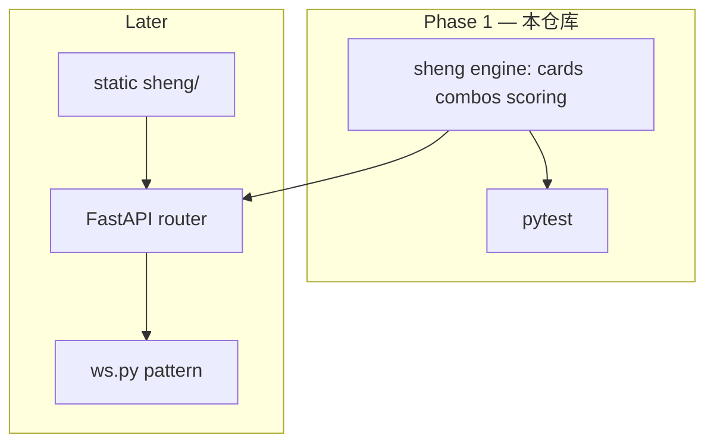

# 升级（Tractor / 拖拉机）经典版 — Phase 1 引擎计划

## 目标范围

本阶段 **仅交付纯 Python 引擎 + 单元测试**，不含 HTTP/WebSocket/前端。

- 支持 **4 人（2 副 108 张）** 与 **6 人（3 副 162 张）**。
- **6 人** 采用 **找朋友**（庄家在扣底前叫两张朋友牌：第 N 张某花色某点）。
- **第一版不含甩牌**（一手出互不相关多张）。

## 规则固化（与用户确认一致）

### 牌与人数

| | 4 人 | 6 人 |
|---|---|---|
| 牌 | 两副含王，共 108 | 三副含王，共 162 |
| 手牌 | 25 | 25 |
| 底牌 | 8 | 12 |
| 闲家阈值 | 80 | 120 |
| 队伍 | 固定 N+S vs E+W | 找朋友：庄叫 2 张牌，3v3 |

### 平局（方案 B）

闲家总分 **恰好等于阈值**（4 人 80 / 6 人 120）：**闲家抢庄，双方级别 +0**（只易位不发级）。

### 找朋友（6 人）

- 叫牌时机：**拿底之后、扣底之前**。
- 形式：`第 N 张` + `花色` + `点数`（10/J/Q/K/A），**不得是主牌点**、**不得是庄家手里已有的牌**。
- **第 N 张** 按全局该 `(花色,点数)` **打出顺序**计数；计到第 N 张时揭牌友身份。
- 朋友不得主动亮身份。

### 主牌顺序（摘要）

大王 > 小王 > 主花主级 > 副主级（同点不同花 **先出者大**）> 主花自然序 non-level…

### 组合

- 4 人：单、对、对子拖拉机。
- 6 人：再加三、三张拖拉机。

---

## 目录结构（Phase 1）

```
backend/app/sheng/
  __init__.py
  cards.py          # 牌实例、发牌、底牌
  trump.py          # 主牌分层、排序键、比大小
  combos.py         # 识别牌型 + 出牌合法性（不含甩牌）
  follow.py         # 跟牌规则（跟型 / 垫牌 / 杀）
  scoring.py        # 5/10/K 分 + 底牌加成 + 升降级阶梯
  friend.py         # 找朋友声明与揭牌
  state.py          # Deal / Match 状态机骨架（供后续阶段接入）

backend/tests/
  test_sheng_combos.py
  test_sheng_scoring.py
  test_sheng_friend.py
  test_sheng_trump.py
```

---

## 后续阶段（不在本提交范围）

| 阶段 | 内容 |
|---|---|
| 2 | `/api/sheng/*` REST + WebSocket，`tables`/`ws` 模式 |
| 3 | `frontend/sheng/` 本地试玩（`/sheng/`） |
| 4 | 部署与联调 |

---

## 架构关系（复用）



---

## TODO（Phase 1 检查表）

- [x] 计划文档
- [x] `cards.py` 多副牌 + 唯一实例 id
- [x] `trump.py` 主序与副主级（平级时先出者胜）
- [x] `combos.py` 对/刻/副牌拖拉机（主牌拖拉机延至 phase 2）
- [x] `follow.py` 跟牌（首版仅单张领出）
- [x] `scoring.py` 分数与升级（含阈值平局 B）
- [x] `friend.py` 第 N 张揭牌
- [x] `state.py` 骨架
- [x] `pytest` 覆盖核心规则

---

## Phase 2（HTTP + WebSocket，本目录进度）

| 条目 | 状态 |
|------|------|
| `app/sheng/tables.py` 房间表、`bank_declarer_seat`、轮转 MVP | done |
| `POST/GET /api/sheng/tables/*`、`actions`、`next_hand` | done |
| `WS /api/sheng/tables/{id}/ws`，`action` / `next_hand` / `ping` | done |
| `RunningHand` 首墩由庄家下家领出 | done |
| 6 人 `friend_calls`（API + WS + `next_hand` 覆盖）；双友均揭牌且三席时终局 3v3 计分，否则对角 | done |
| `frontend/sheng/` 试玩页（热座 + 其他座首张自动代出 + WS） | done |
| Phase 4：部署与联调 | 未开始 |
